# Analyzing election data for Colorado US congressional

## Overview

We will be assiting Tom, who is a colorado board of election employee, to audit the results for US Congressional precint in Colorado.
The main task is to generate a vote count report that presents the following information:

  1. Total number of votes casted
  2. Total number of votes for each candidate
  3. Percentage of votes for each candidate
  4. Winner of the election
 
Python will be the languaje that will be used to perfom this analysis and it is explained as follows:

Since we will be reading a csv file in our code, we have to import the __csv module__ that implements classes to read and write tabular data in CSV format and import the __os module__ that include many functions to interact with the file system.   
The first step is to create a variable to load the information and also, create a varible to save the information obtained from the analysis.

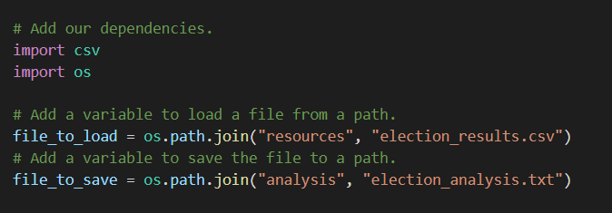

The data contains 369,711 rows from votes casted, that's why lists and dictionaries will be used to store data from candidates, counties and their respective votes.  
The variables to store this data are declared.

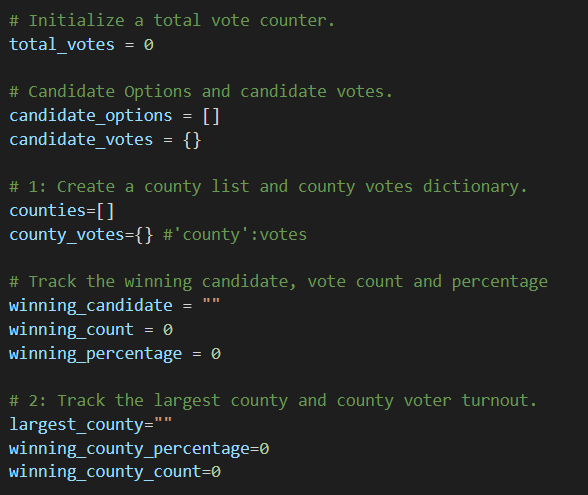

Once all the modules and variables to be used are declared, we proceed to open the file and read the information.  
Most of csv files have headers and this could be a problem in our code, so we use the __next( )__ function to skip the first row.  

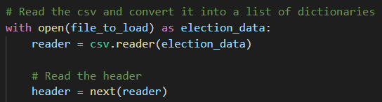

A for loop is used to read through all the rows and being able to sum the number of rows in the file, since every row is a vote. We declare a varibale to store the candidate's name and county in every iteration, and then we use an if statement to add the non-existing values to their respective lists.  

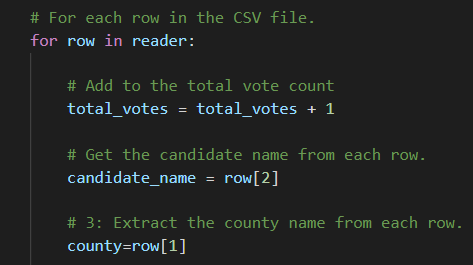

After adding the unique values of candidate's name and county in the lists, we proceed to use the dictionary to store as 'key' the values in the list and initialize the votes in 0 for each candidate and county.

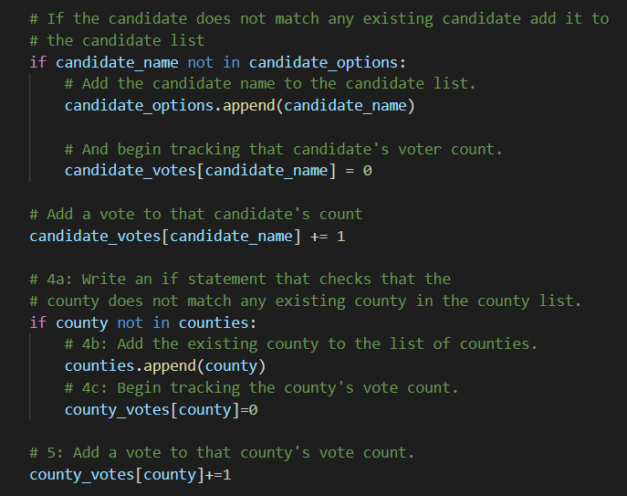

With the code from above we stored the names of the candidates and the counties in lists and in the dictionaries we stored the candidates name and their respective votes, this is the same case for the counties and their respective vote count.
Using this information, the results can be displayed in the terminal and printed in the election_results.txt that will be delivered to Tom.

To write the outputs in the election_results.txt we proceed to open the file and create a variable to print the results with the required format.  
A for loop is used to iretate through the dictionary where the counties and their respective count votes are stored. In each iteration, for each county, we store the votes in the *c_votes* variable and calculate the percentage of votes. Then we print the county, percetage of votes and votes count in the terminal and proceed to write the results in the .txt file. We use the __f-string literals__ to format the result, for percentage of votes we use *__:1f__* to indicate that one decimal is required and for the quantity of votes we use *__:,__* to separte thousands with a comma.   
Finally an if statement is used to compare the county votes and the percetage of votes in order to obtain the county with the highest number of votes.  
The results are formated in a variable and then printed in the .txt file.

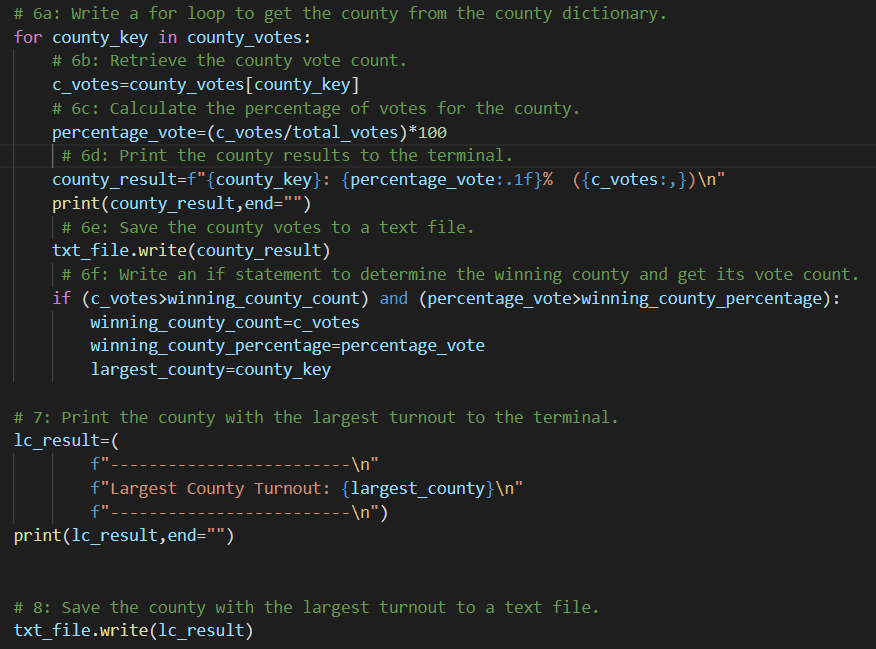

The same logic is applied to display in the termianl and write in the .txt file the amount of votes for each candidate and to determine the winner of the election.

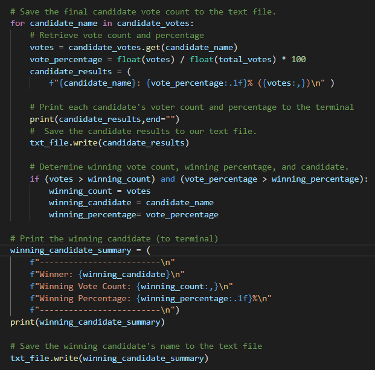

## Election-Audit results

  * How many votes were cast in this congressional election?
  
  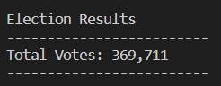

  * Provide a breakdown of the number of votes and the percentage of total votes for each county in the precinct.
  
  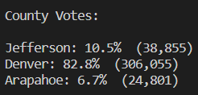

  * Which county had the largest number of votes?

  

  * Provide a breakdown of the number of votes and the percentage of the total votes each candidate received.

  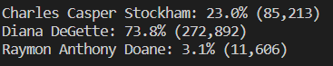

  * Which candidate won the election, what was their vote count, and what was their percentage of the total votes?
  
  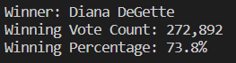
   
The results displayed in the terminal are:

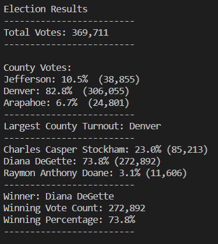
  
 ## Election-Audit Summary

To make the script usable for any election we can add some modifications to it:

  1. Not all csv files will have the same information or header order, but since we only need the ballot ID, county and candidate to get the results we could add a for loop and then conditional statements to iterate though the headers and compare if the actual column header is equal to ballot ID, county or candidate. If the value in the cell matches with the header title, then consider that column for the calculations. This would require more work 
  
  2. Add conditional statements in the case of tying some candidates or counties regarding votes, and then display the results in the terminal and write them in the file.txt .
